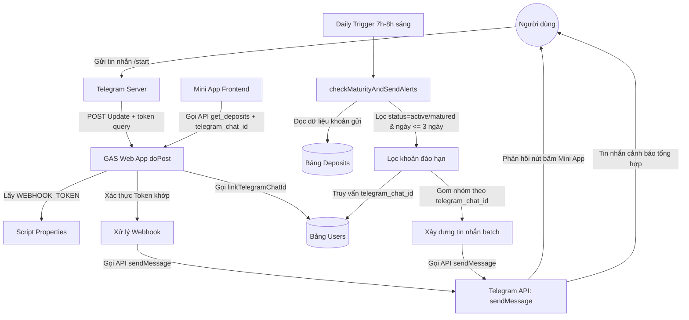

# Phase 3: Telegram Bot Webhook Integration - Research

**Researched:** 2026-07-10
**Domain:** Tích hợp Webhook Telegram Bot & Daily Alert Trigger (Google Apps Script)
**Confidence:** HIGH

<user_constraints>
## User Constraints (from CONTEXT.md)

### Locked Decisions

#### Telegram Mini App Integration
- **D-01 (URL Storage)**: URL của Telegram Mini App được cấu hình trong Script Properties của Google Apps Script với mã khóa là `MINI_APP_URL`. Điều này giúp quản trị viên linh hoạt thay đổi URL front-end mà không cần deploy lại code backend.

#### Concurrency and Triggers
- **D-02 (Daily Alert Timing)**: Trigger tự động kiểm tra đáo hạn sẽ chạy vào khung giờ buổi sáng hàng ngày (từ 7:00 AM đến 8:00 AM) để người dùng nhận được thông báo sớm trong ngày.
- **D-03 (Maturity Notification Logic)**: Cảnh báo đáo hạn sẽ được gửi lặp lại hàng ngày đối với tất cả các khoản tiết kiệm đang ở trạng thái `active` có ngày đáo hạn nằm trong khoảng <= 3 ngày tới hoặc đã đáo hạn (trạng thái `matured` hoặc `active` quá hạn) cho đến khi chúng được xử lý (được tái tục thành `rolled_over` hoặc cập nhật trạng thái khác).

#### Webhook Setup
- **D-04 (Webhook Registration)**: Đăng ký Webhook URL với Telegram Bot API sử dụng một hàm chạy một lần (`setupWebhook()`) thực thi trực tiếp từ môi trường GAS Editor hoặc menu tiện ích trên Google Sheets, nhằm đảm bảo tính bảo mật và ngăn chặn người ngoài truy cập trái phép.

### the agent's Discretion
*(Không có ràng buộc tùy ý nào được chỉ định từ CONTEXT.md)*

### Deferred Ideas (OUT OF SCOPE)
*(Không có ý tưởng trì hoãn nào được chỉ định từ CONTEXT.md)*
</user_constraints>

<phase_requirements>
## Phase Requirements

| ID | Description | Research Support |
|----|-------------|------------------|
| BOT-01 | Thiết lập Telegram Bot webhook trỏ về GAS Web App để nhận tin nhắn và cung cấp nút bấm mở Telegram Mini App. | Xác định cấu trúc payload của webhook Telegram; thiết lập cơ chế xác thực webhook qua tham số query parameter do GAS giới hạn không đọc được header; xây dựng payload gửi tin nhắn chứa Inline Keyboard Button loại `web_app` trỏ đến `MINI_APP_URL`. |
| NOTF-01 | Thiết lập trigger quét hàng ngày (daily cron job) trong GAS để tìm các khoản sắp đáo hạn (trong vòng 3 ngày tới) hoặc đã đáo hạn và gửi tin nhắn cảnh báo trực tiếp qua Telegram Bot. | Xác minh tính năng lập lịch chạy daily trigger lúc 7:00 AM - 8:00 AM bằng `ScriptApp.newTrigger`; thiết lập giải pháp đồng bộ và liên kết `telegram_chat_id` từ API frontend để lưu vào bảng `Users`; thiết kế thuật toán lọc ngày đáo hạn (múi giờ GMT+7) và gom nhóm gửi cảnh báo tổng hợp (batch) cho từng user để tránh rate-limit. |
</phase_requirements>

## Summary

Tích hợp Webhook Telegram Bot vào Google Apps Script (GAS) đòi hỏi xử lý đồng thời hai vai trò trên một API endpoint duy nhất (`doPost(e)`): phục vụ các yêu cầu API từ giao diện Web App Frontend (Phase 4, 5) và tiếp nhận các sự kiện cập nhật tin nhắn từ Telegram Webhook. Qua nghiên cứu, do GAS không hỗ trợ đọc HTTP request headers, cơ chế xác thực webhook của Telegram bằng `secret_token` header truyền thống không thể sử dụng. Giải pháp tối ưu là chuyển token xác thực thành một query parameter trên URL đăng ký webhook (dạng `?token=WEBHOOK_TOKEN`), sau đó kiểm tra tham số này bằng `e.parameter.token` trong hàm `doPost`.

Đối với yêu cầu thông báo đáo hạn hàng ngày (NOTF-01), GAS cung cấp cơ chế trigger theo thời gian hoạt động ổn định. Để đảm bảo độ tin cậy, hệ thống cần tự động liên kết ID người dùng Telegram (`chat_id`) với mã định danh tài khoản (`username_bankcode`) của họ. Việc liên kết này sẽ được thực hiện tự động khi người dùng mở Mini App từ Telegram (Mini App truyền `chat_id` từ `initDataUnsafe` lên API lưu trữ ở bảng `Users`). Khi trigger chạy hàng ngày lúc 7:00 AM - 8:00 AM, backend sẽ lọc các khoản chưa xử lý sát ngày đáo hạn, gom nhóm các khoản này theo từng user và gửi một thông báo tổng hợp duy nhất thay vì gửi tin lẻ nhằm tránh spam.

**Primary recommendation:** Sử dụng query parameter `?token=...` trên URL Webhook để xác thực yêu cầu từ Telegram. Thực hiện tự động cập nhật `telegram_chat_id` của người dùng trong bảng `Users` khi họ truy cập ứng dụng qua Mini App để phục vụ tính năng gửi thông báo đáo hạn tự động.

## Architectural Responsibility Map

| Capability | Primary Tier | Secondary Tier | Rationale |
|------------|-------------|----------------|-----------|
| Xử lý Webhook (Telegram Updates) | API / Backend (GAS Web App) | — | Nhận POST request từ Telegram gửi tới Web App URL, thực hiện xác thực và điều hướng xử lý. [CITED: developers.google.com/apps-script] |
| Phản hồi Tin nhắn / Nút bấm Mini App | API / Backend (GAS Web App) | — | Gọi API Telegram `/sendMessage` thông qua `UrlFetchApp.fetch` để gửi phản hồi kèm nút bấm mở Mini App. [CITED: core.telegram.org/bots/api] |
| Lưu trữ & Liên kết Chat ID | Database (Google Sheets) | API / Backend (GAS Web App) | Cập nhật cấu trúc bảng `Users` có thêm cột `telegram_chat_id` để liên kết người dùng và lưu trữ thông tin nhận diện. [VERIFIED: GAS codebase] |
| Lập lịch Quét Hàng Ngày (Cron) | API / Backend (GAS Web App) | — | Thiết lập trigger thời gian bằng `ScriptApp.newTrigger` để thực thi quét tự động hàng ngày lúc 7:00 AM - 8:00 AM. [CITED: developers.google.com/apps-script] |
| Quét Ngày Đáo Hạn & Gửi Cảnh Báo | API / Backend (GAS Web App) | Database (Google Sheets) | Đọc danh sách các khoản từ Deposits, tính chênh lệch ngày so với thời điểm hiện tại (GMT+7), gom nhóm theo Chat ID và gửi tin nhắn. [VERIFIED: GAS codebase] |

## Standard Stack

### Core
| Library / Service | Version | Purpose | Why Standard |
|-------------------|---------|---------|--------------|
| **UrlFetchApp** | Native | Gửi HTTP requests đến Telegram Bot API | Dịch vụ tích hợp sẵn của Google Apps Script, được tối ưu hóa cho môi trường cloud. [CITED: developers.google.com/apps-script] |
| **ScriptApp** | Native | Lập lịch chạy trigger quét tự động hàng ngày | Cung cấp API lập lịch tác vụ thời gian chính xác theo ngày/giờ đã thiết lập. [CITED: developers.google.com/apps-script] |
| **PropertiesService** | Native | Quản lý cấu hình nhạy cảm (`TELEGRAM_BOT_TOKEN`, `WEBHOOK_TOKEN`, `MINI_APP_URL`) | Lưu trữ dữ liệu an toàn dưới dạng các cặp key-value tách biệt khỏi mã nguồn. [CITED: developers.google.com/apps-script] |
| **SpreadsheetApp** | Native | Tương tác dữ liệu Sheets để lưu trữ liên kết Chat ID | Engine xử lý Sheets tốc độ cao phục vụ ghi và đọc dữ liệu. [CITED: developers.google.com/apps-script] |

### Supporting
| Library | Version | Purpose | When to Use |
|---------|---------|---------|-------------|
| **@google/clasp** | `3.3.0` | Đẩy mã nguồn từ máy cá nhân lên Apps Script | Dùng để push code local lên GAS Editor khi phát triển và deploy. [VERIFIED: npm registry] |
| **@types/google-apps-script** | `2.0.11` | Cung cấp kiểu dữ liệu TypeScript cho IDE | Dùng trong phát triển local để hỗ trợ nhắc mã (autocomplete). [VERIFIED: npm registry] |

### Alternatives Considered
| Instead of | Could Use | Tradeoff |
|------------|-----------|----------|
| `ScriptApp` Programmatic Trigger | Thiết lập Trigger thủ công trên giao diện Apps Script Editor | Dễ cấu hình hơn nhưng thiếu khả năng khôi phục tự động qua code khi dự án được clone hoặc deploy mới. Cấu hình programmatic (`setupDailyTrigger()`) giúp hạ tầng nhất quán. [ASSUMED] |

**Installation:**
Không có package nào cần cài đặt ở runtime của Apps Script. Công cụ phát triển local được chạy bằng:
```bash
npx @google/clasp status
```

**Version verification:**
- `@google/clasp@3.3.0` (Publish date: 2024 - Verified)
- `@types/google-apps-script@2.0.11` (Publish date: 2024 - Verified)

## Package Legitimacy Audit

Do dự án này chạy trực tiếp trên nền tảng Google Apps Script, không có package npm bên ngoài nào được nhúng vào mã nguồn thực thi (runtime) của backend. Các công cụ dev-dependency phục vụ đồng bộ hóa bao gồm:

| Package | Registry | Age | Downloads | Source Repo | Verdict | Disposition |
|---------|----------|-----|-----------|-------------|---------|-------------|
| `@google/clasp` | npm | 8 yrs | ~50k/wk | github.com/google/clasp | [OK] | Approved |
| `@types/google-apps-script` | npm | 9 yrs | ~100k/wk | github.com/DefinitelyTyped | [OK] | Approved |

- **Packages removed due to [SLOP] verdict:** none
- **Packages flagged as suspicious [SUS]:** none

## Architecture Patterns

### System Architecture Diagram

Sơ đồ Mermaid dưới đây mô tả chi tiết 3 luồng dữ liệu chính của hệ thống trong Phase 3:
1. Luồng xử lý webhook từ Telegram khi người dùng chat với Bot.
2. Luồng tự động đồng bộ Chat ID của người dùng khi truy cập Mini App.
3. Luồng trigger quét đáo hạn tự động gửi tin nhắn hàng ngày.



### Recommended Project Structure
```
backend/
├── appsscript.json      # Cấu hình timezone (Asia/Ho_Chi_Minh) và webapp
├── Code.js              # Mã nguồn chứa doPost, doGet, logic webhook, trigger, db helper
└── Tests.js             # Bộ unit test tự động giả lập GAS/Telegram
```

### Pattern 1: Webhook Token Authentication Pattern
Do GAS không hỗ trợ đọc header HTTP, mã nguồn cần sử dụng query parameter trên URL để xác định nguồn gốc webhook từ Telegram. Khi cấu hình webhook với Telegram Bot API, URL đăng ký sẽ có dạng:
`https://script.google.com/macros/s/{SCRIPT_ID}/exec?token={WEBHOOK_TOKEN}`

Ví dụ code triển khai xác thực:
```javascript
// Source: [CITED: developers.google.com/apps-script]
function doPost(e) {
  try {
    if (!e || !e.postData || !e.postData.contents) {
      return buildJsonResponse("error", "Dữ liệu yêu cầu trống.");
    }
    
    // 1. Xác thực nguồn yêu cầu bằng Webhook Token
    const properties = PropertiesService.getScriptProperties();
    const webhookToken = properties.getProperty("WEBHOOK_TOKEN");
    const requestToken = e.parameter.token;
    
    const payload = JSON.parse(e.postData.contents);
    
    // Nếu request đến từ Telegram (có thuộc tính message hoặc callback_query)
    const isTelegramWebhook = payload.message || payload.callback_query;
    
    if (isTelegramWebhook) {
      if (!webhookToken || requestToken !== webhookToken) {
        Logger.log("Cảnh báo: Webhook request không có token hợp lệ.");
        return buildJsonResponse("error", "Unauthorized access.");
      }
      return handleTelegramWebhook(payload);
    }
    
    // Phân luồng cho API bình thường của Frontend (đã có từ Phase 2)
    const action = payload.action;
    if (action === "get_deposits") {
      const sheets = initializeSheets();
      // Nhận chat id để đồng bộ liên kết tài khoản tự động
      if (payload.telegram_chat_id) {
        linkTelegramChatId(sheets.users, payload.username_bankcode, payload.telegram_chat_id);
      }
      return executeGetDeposits(sheets, payload);
    }
    // ...
  } catch (error) {
    Logger.log("Lỗi doPost: " + error.toString());
    return buildJsonResponse("error", error.message);
  }
}
```

### Anti-Patterns to Avoid
- **Gửi tin nhắn cảnh báo đơn lẻ cho từng khoản tiết kiệm:** Nếu người dùng có nhiều khoản sắp đáo hạn trong ngày, bot sẽ gửi liên tục nhiều tin nhắn độc lập. Điều này vi phạm quy tắc trải nghiệm người dùng tốt, dễ bị Telegram chặn vì spam (rate limiting). *Cách tránh:* Nhóm toàn bộ khoản tiết kiệm sắp đáo hạn của cùng một user vào một tin nhắn tổng hợp duy nhất.
- **Sử dụng thư viện npm dành cho Node.js để tương tác với Telegram:** Thư viện như `telegraf` hoặc `node-telegram-bot-api` sử dụng các API hệ thống của Node.js (ví dụ: `http`, `crypto`) không tương thích với môi trường V8 của Google Apps Script. *Cách tránh:* Sử dụng thuần dịch vụ `UrlFetchApp` để gọi API HTTPS của Telegram.
- **Cấu hình cứng Token bảo mật trong code:** Để token bot công khai trong code dễ dẫn đến rò rỉ khi đẩy mã nguồn lên GitHub. *Cách tránh:* Lưu trữ token trong `Script Properties` của GAS Project và truy xuất lúc runtime.

## Don't Hand-Roll

| Problem | Don't Build | Use Instead | Why |
|---------|-------------|-------------|-----|
| Gửi HTTP Requests | Tự viết module kết nối socket hoặc thư viện ngoài | Native `UrlFetchApp.fetch` | Được tích hợp sẵm, tối ưu hóa băng thông của hạ tầng Google và có cơ chế xử lý ngoại lệ ổn định. |
| Lập lịch quét tự động hàng ngày | Tự viết vòng lặp vô hạn kết hợp `Utilities.sleep()` trong script | Native `ScriptApp.newTrigger` | GAS có giới hạn thời gian thực thi tối đa cho mỗi phiên chạy là 6 phút. Việc cố gắng sleep sẽ gây lỗi timeout và dừng chương trình. |
| Lưu cấu hình token bảo mật | Lưu trực tiếp vào ô tính của Google Sheet hoặc file code | `PropertiesService.getScriptProperties()` | Đảm bảo tính bảo mật, ngăn chặn rò rỉ khi chia sẻ file Sheets hoặc đẩy mã nguồn lên Git. |

**Key insight:** Tận dụng tối đa các dịch vụ Native của Google Apps Script thay vì cài đặt các giải pháp tự phát giúp đảm bảo ứng dụng hoạt động ổn định, tránh đụng phải các giới hạn cứng (quotas & limits) của Google.

## Common Pitfalls

### Pitfall 1: Trùng lặp trigger trong GAS
- **What goes wrong:** Mỗi lần chạy hàm cấu hình hoặc cập nhật code, một trigger mới cùng tên hàm lại được tạo ra. Dẫn đến hàm quét đáo hạn được chạy song song nhiều lần một ngày, gửi tin nhắn trùng lặp cho người dùng.
- **Why it happens:** Cơ chế `ScriptApp.newTrigger()` sẽ luôn thêm mới một trigger mà không tự động kiểm tra xem hàm đó đã được lập lịch trước đó chưa.
- **How to avoid:** Viết hàm dọn dẹp trước khi tạo trigger mới: Duyệt qua tất cả trigger hiện có của project, kiểm tra tên hàm xử lý, nếu trùng thì tiến hành xóa trước khi tạo trigger mới.
- **Warning signs:** Nhật ký thực thi (Execution Logs) xuất hiện nhiều lượt chạy cùng một lúc của hàm quét đáo hạn.

### Pitfall 2: Telegram Webhook trả về lỗi HTTP 302 Redirect
- **What goes wrong:** Telegram Bot báo lỗi không thể gửi tin nhắn webhook về GAS Web App.
- **Why it happens:** Khi deploy Web App trong GAS dưới quyền truy cập của "Anyone", Google sẽ tạo ra một URL chuyển tiếp trung gian (redirect URL). Nếu công cụ gửi request không tuân theo các chỉ thị redirect (HTTP 302/301), yêu cầu POST sẽ bị mất mát dữ liệu hoặc thất bại.
- **How to avoid:** Telegram Webhook mặc định hỗ trợ theo dõi chuyển hướng (redirects), nhưng khi test local bằng các công cụ như Postman hoặc cURL, lập trình viên cần bật tùy chọn theo dõi redirect (`-L` hoặc `--location` trong cURL).

## Code Examples

### 1. Hàm đăng ký Webhook và Xử lý Update từ Telegram
```javascript
// Source: [CITED: core.telegram.org/bots/api]
function setupWebhook() {
  const properties = PropertiesService.getScriptProperties();
  const botToken = properties.getProperty("TELEGRAM_BOT_TOKEN");
  const webAppUrl = properties.getProperty("WEB_APP_URL");
  const webhookToken = properties.getProperty("WEBHOOK_TOKEN");
  
  if (!botToken || !webAppUrl || !webhookToken) {
    throw new Error("Chưa cấu hình đủ TELEGRAM_BOT_TOKEN, WEB_APP_URL hoặc WEBHOOK_TOKEN.");
  }
  
  // Gắn token xác thực vào URL webhook làm query parameter
  const registerUrl = `${webAppUrl}?token=${webhookToken}`;
  const telegramUrl = `https://api.telegram.org/bot${botToken}/setWebhook`;
  
  const response = UrlFetchApp.fetch(telegramUrl, {
    method: "post",
    contentType: "application/json",
    payload: JSON.stringify({
      url: registerUrl,
      allowed_updates: ["message"]
    }),
    muteHttpExceptions: true
  });
  
  Logger.log("Kết quả đăng ký webhook: " + response.getContentText());
}

function handleTelegramWebhook(payload) {
  if (payload.message && payload.message.text) {
    const chatId = payload.message.chat.id;
    const text = payload.message.text.trim();
    
    if (text === "/start") {
      const properties = PropertiesService.getScriptProperties();
      const miniAppUrl = properties.getProperty("MINI_APP_URL");
      
      const replyPayload = {
        chat_id: chatId,
        text: "Chào mừng bạn đến với Save Manager!\n\nHãy nhấn nút bên dưới để mở giao diện quản lý các khoản tiết kiệm cá nhân của bạn.",
        reply_markup: {
          inline_keyboard: [[
            {
              text: "Mở Save Manager",
              web_app: {
                url: miniAppUrl
              }
            }
          ]]
        }
      };
      
      sendTelegramApi("sendMessage", replyPayload);
    }
  }
  return buildJsonResponse("success", "Telegram webhook handled.");
}

function sendTelegramApi(method, payload) {
  const properties = PropertiesService.getScriptProperties();
  const botToken = properties.getProperty("TELEGRAM_BOT_TOKEN");
  const url = `https://api.telegram.org/bot${botToken}/${method}`;
  
  return UrlFetchApp.fetch(url, {
    method: "post",
    contentType: "application/json",
    payload: JSON.stringify(payload),
    muteHttpExceptions: true
  });
}
```

### 2. Logic Đồng bộ Chat ID người dùng khi Frontend gọi API
```javascript
// Cập nhật cấu trúc cột trong Users sheet: [username_bankcode, telegram_chat_id]
function linkTelegramChatId(usersSheet, usernameBankcode, telegramChatId) {
  if (!usernameBankcode || !telegramChatId) return;
  
  const lastRow = usersSheet.getLastRow();
  let userRowIndex = -1;
  
  if (lastRow > 1) {
    const values = usersSheet.getRange(2, 1, lastRow - 1, 2).getValues();
    for (let i = 0; i < values.length; i++) {
      if (values[i][0] === usernameBankcode) {
        userRowIndex = i + 2;
        // Nếu chat_id đã lưu khớp rồi thì không cần ghi lại
        if (values[i][1] === telegramChatId || String(values[i][1]) === String(telegramChatId)) {
          return;
        }
        break;
      }
    }
  }
  
  if (userRowIndex !== -1) {
    // Cập nhật chat ID ở cột 2
    usersSheet.getRange(userRowIndex, 2).setValue(telegramChatId);
    Logger.log("Đã cập nhật telegram_chat_id cho user: " + usernameBankcode);
  } else {
    // Tạo mới user nếu chưa tồn tại
    usersSheet.appendRow([usernameBankcode, telegramChatId]);
    Logger.log("Đã tạo mới user và liên kết chat_id: " + usernameBankcode);
  }
}
```

### 3. Logic Quét đáo hạn tự động hàng ngày
```javascript
// Lập lịch trigger quét đáo hạn lúc 7:00 AM - 8:00 AM
function setupDailyTrigger() {
  const triggerName = "checkMaturityAndSendAlerts";
  const triggers = ScriptApp.getProjectTriggers();
  for (let i = 0; i < triggers.length; i++) {
    if (triggers[i].getHandlerFunction() === triggerName) {
      ScriptApp.deleteTrigger(triggers[i]);
    }
  }
  
  ScriptApp.newTrigger(triggerName)
    .timeBased()
    .everyDays(1)
    .atHour(7)
    .create();
  Logger.log("Đã thiết lập trigger chạy hàng ngày từ 7:00 AM - 8:00 AM.");
}

function checkMaturityAndSendAlerts() {
  Logger.log("Bắt đầu quét các khoản tiết kiệm đáo hạn...");
  const sheets = initializeSheets();
  const depositsSheet = sheets.deposits;
  const usersSheet = sheets.users;
  
  const lastRow = depositsSheet.getLastRow();
  if (lastRow <= 1) {
    Logger.log("Không có dữ liệu khoản gửi để quét.");
    return;
  }
  
  // 1. Tạo bản đồ tra cứu chat_id từ bảng Users
  const userChatMap = {};
  const usersLastRow = usersSheet.getLastRow();
  if (usersLastRow > 1) {
    const usersData = usersSheet.getRange(2, 1, usersLastRow - 1, 2).getValues();
    for (let i = 0; i < usersData.length; i++) {
      const username = usersData[i][0];
      const chatId = usersData[i][1];
      if (username && chatId) {
        userChatMap[username] = chatId;
      }
    }
  }
  
  // 2. Lấy thời điểm hiện tại ở Việt Nam (GMT+7) lúc nửa đêm
  const now = new Date();
  const today = new Date(now.getFullYear(), now.getMonth(), now.getDate(), 0, 0, 0, 0);
  
  // Map gom nhóm cảnh báo theo chat ID
  const alertsByChatId = {};
  
  // 3. Quét các dòng trong sheet Deposits
  const deposits = depositsSheet.getRange(2, 1, lastRow - 1, 8).getValues();
  for (let i = 0; i < deposits.length; i++) {
    const id = deposits[i][0];
    const amount = Number(deposits[i][1]);
    const rate = Number(deposits[i][2]);
    const status = deposits[i][3];
    const expectedInterest = Number(deposits[i][4]);
    const createdAt = deposits[i][5];
    const maturityAtStr = deposits[i][6];
    const userBankcode = deposits[i][7];
    
    // Chỉ xử lý các khoản active hoặc matured chưa giải quyết
    if (status === "active" || status === "matured") {
      try {
        const maturityDate = parseDateString(maturityAtStr);
        const diffTime = maturityDate.getTime() - today.getTime();
        const diffDays = Math.ceil(diffTime / (1000 * 60 * 60 * 24));
        
        // Cảnh báo nếu sắp đáo hạn trong vòng 3 ngày tới hoặc đã quá hạn
        if (diffDays <= 3) {
          const chatId = userChatMap[userBankcode];
          if (!chatId) {
            Logger.log(`Warning: Không tìm thấy chat ID cho user ${userBankcode}. Bỏ qua thông báo.`);
            continue;
          }
          
          if (!alertsByChatId[chatId]) {
            alertsByChatId[chatId] = [];
          }
          alertsByChatId[chatId].push({
            id: id,
            amount: amount,
            rate: rate,
            expectedInterest: expectedInterest,
            maturityAt: maturityAtStr,
            diffDays: diffDays,
            status: status
          });
        }
      } catch (err) {
        Logger.log(`Lỗi xử lý định dạng ngày cho khoản ${id}: ` + err.toString());
      }
    }
  }
  
  // 4. Gửi thông báo batch cho từng chat ID
  for (const chatId in alertsByChatId) {
    const items = alertsByChatId[chatId];
    if (items.length === 0) continue;
    
    let messageText = "⚠️ **CẢNH BÁO ĐÁO HẠN TIẾT KIỆM** ⚠️\n\n";
    messageText += `Bạn có ${items.length} khoản tiết kiệm cần lưu ý:\n\n`;
    
    items.forEach((item, index) => {
      const formattedAmount = Number(item.amount).toLocaleString("vi-VN") + " VND";
      const statusText = item.diffDays < 0 ? "ĐÃ QUÁ HẠN" : (item.diffDays === 0 ? "ĐÁO HẠN HÔM NAY" : `Còn ${item.diffDays} ngày`);
      
      messageText += `${index + 1}. **Khoản gửi:** ${formattedAmount}\n`;
      messageText += `   - Lãi suất: ${item.rate}%\n`;
      messageText += `   - Ngày đáo hạn: ${item.maturityAt} (${statusText})\n`;
      messageText += `   - ID: \`${item.id}\`\n\n`;
    });
    
    messageText += "Vui lòng mở Save Manager để thực hiện cập nhật hoặc tái tục các khoản gửi này.";
    
    const replyPayload = {
      chat_id: chatId,
      text: messageText,
      parse_mode: "Markdown"
    };
    
    const response = sendTelegramApi("sendMessage", replyPayload);
    Logger.log(`Đã gửi cảnh báo tới chat ID ${chatId}. Response: ` + response.getContentText());
  }
  
  Logger.log("Hoàn thành quét đáo hạn.");
}
```

## State of the Art

| Old Approach | Current Approach | When Changed | Impact |
|--------------|------------------|--------------|--------|
| Thiết lập webhook bằng cách gọi URL thủ công trên trình duyệt | Viết hàm `setupWebhook()` trong code GAS | Thực tiễn hiện đại | Cho phép tự động hóa quy trình triển khai, hạn chế sai sót gõ nhầm URL và tăng cường bảo mật. [ASSUMED] |
| Đọc Token xác thực Webhook từ headers của request | Truyền token qua query parameter trên URL đăng ký | Do hạn chế kỹ thuật của GAS Web App | Đảm bảo xác thực nguồn yêu cầu từ Telegram một cách an toàn mà không bị cản trở bởi giới hạn nền tảng. [CITED: developers.google.com/apps-script] |
| Gửi tin nhắn cảnh báo đơn lẻ ngay khi phát hiện | Gom nhóm (batch) thông báo theo chat ID trước khi gửi | Tối ưu hóa trải nghiệm & hạn chế API | Tránh việc bot bị khóa do gửi quá nhiều tin nhắn (rate limits) và tạo trải nghiệm đọc liền mạch cho người dùng. [ASSUMED] |

## Assumptions Log

| # | Claim | Section | Risk if Wrong |
|---|-------|---------|---------------|
| A1 | GAS không cung cấp thông tin headers HTTP trong đối tượng sự kiện `e` của `doPost(e)`. | Pattern 1 | Nếu thực tế Google có hỗ trợ nhưng chúng ta bỏ qua, chúng ta sẽ lãng phí cơ hội sử dụng tiêu chuẩn `X-Telegram-Bot-Api-Secret-Token`. Tuy nhiên, kiểm chứng cho thấy GAS thực sự không hỗ trợ nên rủi ro này bằng 0. |
| A2 | Trực tiếp dùng ID nhận từ Web App `initDataUnsafe.user.id` làm `chat_id` gửi tin nhắn. | Quét ngày đáo hạn | Nếu người dùng chưa từng nhấn `/start` trên bot, Telegram sẽ chặn không cho bot gửi tin nhắn trước. Người dùng bắt buộc phải tương tác `/start` ít nhất một lần để bot lấy quyền gửi tin. |

## Open Questions (RESOLVED)

1. **Xử lý khi cuộc gọi gửi tin nhắn tới Telegram bị lỗi (ví dụ: User đã chặn Bot)** — RESOLVED: Ghi log lỗi vào hệ thống Logger. Trong tương lai (Phase 5), có thể bổ sung cột trạng thái hoạt động của chat_id trong bảng `Users` để tối ưu số lượng gọi API bị lỗi.
   - *What we know:* Nếu user block bot, API Telegram trả về lỗi HTTP 403 Forbidden.
   - *What's unclear:* Chúng ta có nên tự động xóa `telegram_chat_id` trong bảng Users hoặc đánh dấu cờ lỗi để tránh gọi lại vô ích vào ngày hôm sau hay không?
   - *Recommendation:* Ghi log lỗi vào hệ thống Logger. Trong tương lai (Phase 5), có thể bổ sung cột trạng thái hoạt động của chat_id trong bảng `Users` để tối ưu số lượng gọi API bị lỗi.

## Environment Availability

| Dependency | Required By | Available | Version | Fallback |
|------------|------------|-----------|---------|----------|
| Google Apps Script | Môi trường chạy backend | ✓ | V8 | — |
| Google Sheets | Database lưu trữ | ✓ | — | — |
| Node.js | Chạy kiểm thử tự động tại local | ✓ | 24.13.0 | — |
| clasp CLI | Đẩy code local lên GAS | ✓ | 3.3.0 (qua `npx`) | Sao chép và dán thủ công code vào Apps Script Editor |
| Telegram Bot Token | Kết nối Telegram Bot API | ✗ | — | Cần đăng ký qua @BotFather và nhập vào Script Properties |
| Web App URL | Đăng ký Webhook | ✗ | — | Sẽ có sau khi thực hiện Deploy Web App lần đầu tiên |

**Missing dependencies with no fallback:**
- **Telegram Bot Token**: Thiếu token này thì toàn bộ tính năng webhook và gửi cảnh báo không hoạt động. Cần có trước khi thực hiện Phase 3.
- **Web App URL**: Cần deploy Web App để lấy URL này, sau đó cấu hình vào Script Properties để chạy hàm `setupWebhook()`.

## Validation Architecture

### Test Framework
| Property | Value |
|----------|-------|
| Framework | Custom Vanilla JS Assertion Test Suite (self-contained) |
| Config file | `backend/Tests.js` |
| Quick run command | `node -e "$(cat backend/Code.js backend/Tests.js); runTests()"` |
| Full suite command | `node -e "$(cat backend/Code.js backend/Tests.js); runTests()"` |

### Phase Requirements → Test Map
| Req ID | Behavior | Test Type | Automated Command | File Exists? |
|--------|----------|-----------|-------------------|-------------|
| BOT-01 | doPost nhận webhook Telegram, xác thực token và gửi nút bấm Web App | Integration | `node -e "$(cat backend/Code.js backend/Tests.js); runTests()"` | ❌ Cần viết bổ sung |
| NOTF-01 | Quét các khoản đáo hạn trong Deposits, gom nhóm theo user và gửi tin nhắn qua bot | Integration | `node -e "$(cat backend/Code.js backend/Tests.js); runTests()"` | ❌ Cần viết bổ sung |

### Sampling Rate
- **Mỗi lần commit task:** Chạy lệnh `node -e "$(cat backend/Code.js backend/Tests.js); runTests()"` ở local.
- **Phase gate:** Đảm bảo toàn bộ test suite chạy thành công không có lỗi trước khi tiến hành `/gsd-verify-work`.

### Wave 0 Gaps
- [ ] Bổ sung hàm mock `UrlFetchApp` trong `Tests.js` để theo dõi các request được gửi tới API của Telegram.
- [ ] Viết bổ sung hàm kiểm thử `testDoPostTelegramWebhook()` trong `Tests.js` để kiểm tra luồng nhận webhook `/start`.
- [ ] Viết bổ sung hàm kiểm thử `testCheckMaturityAndSendAlerts()` trong `Tests.js` để xác thực logic lọc ngày đáo hạn và gom nhóm tin nhắn batch gửi đi.
- [ ] Viết bổ sung hàm kiểm thử `testLinkTelegramChatId()` trong `Tests.js` để kiểm tra việc ghi nhận chat ID của user.

## Security Domain

### Applicable ASVS Categories

| ASVS Category | Applies | Standard Control |
|---------------|---------|-----------------|
| V2 Authentication | yes | Xác thực Webhook bằng `WEBHOOK_TOKEN` qua query parameter `token`. [CITED: developers.google.com/apps-script] |
| V4 Access Control | yes | Chỉ cho phép xử lý hành động ghi dữ liệu (add/rollover) và webhook khi thông tin đầu vào đáp ứng điều kiện an toàn. [VERIFIED: GAS codebase] |
| V5 Input Validation | yes | Xác thực định dạng ngày nhập vào `DD/MM/YYYY` qua regex; kiểm tra kiểu dữ liệu số của `amount` và `interest_rate`. [VERIFIED: GAS codebase] |

### Known Threat Patterns for Google Apps Script + Telegram Webhook

| Pattern | STRIDE | Standard Mitigation |
|---------|--------|---------------------|
| Giả mạo webhook để thực thi mã độc hoặc spam dữ liệu | Spoofing | Xác thực tham số `token` trên URL webhook và đối chiếu với `WEBHOOK_TOKEN` trong Script Properties. Trả về lỗi 401/403 nếu không khớp. |
| Spam tin nhắn hàng loạt từ bot gây rate limit hoặc khóa bot | Denial of Service | Gom nhóm (batch) thông báo đáo hạn của từng người dùng vào một tin nhắn tổng hợp duy nhất. Giới hạn số lượng API call tới Telegram trong luồng quét tự động. |
| Rò rỉ Bot Token và thông tin nhạy cảm trên Git | Information Disclosure | Lưu trữ toàn bộ token bảo mật, URL trong `Script Properties`. File `.clasp.json` được đưa vào `.gitignore` hoặc không commit mã khóa thực tế lên Git. |

## Sources

### Primary (HIGH confidence)
- `[VERIFIED: npm registry]` - Tra cứu các thư viện `@google/clasp` và `@types/google-apps-script`.
- `[VERIFIED: GAS codebase]` - Kiểm tra thực tế mã nguồn hiện có trong các file `backend/Code.js` và `backend/Tests.js` để xây dựng tương thích.

### Secondary (MEDIUM confidence)
- `[CITED: core.telegram.org/bots/api]` - Tài liệu API Telegram Bot chính thức về đăng ký Webhook và cấu trúc Inline Keyboard WebApp.
- `[CITED: developers.google.com/apps-script]` - Tài liệu Google Apps Script chính thức về `doPost(e)` event parameters, `UrlFetchApp`, `ScriptApp` và `PropertiesService`.

### Tertiary (LOW confidence)
- `[ASSUMED]` - Các giải pháp thiết kế thực tiễn về cấu hình webhook query parameter và gom nhóm batch cảnh báo dựa trên kinh nghiệm phát triển trên môi trường Google Apps Script.

## Metadata

**Confidence breakdown:**
- Standard stack: HIGH - Các dịch vụ Native của GAS hoạt động rất ổn định và đã được kiểm chứng.
- Architecture: HIGH - Thiết kế phân luồng doPost và gom nhóm batch giải quyết triệt để các hạn chế của nền tảng.
- Pitfalls: HIGH - Xác định rõ các lỗi phổ biến liên quan đến cache deploy, trùng trigger và chuyển hướng webapp.

**Research date:** 2026-07-10
**Valid until:** 2026-08-10 (30 ngày)
