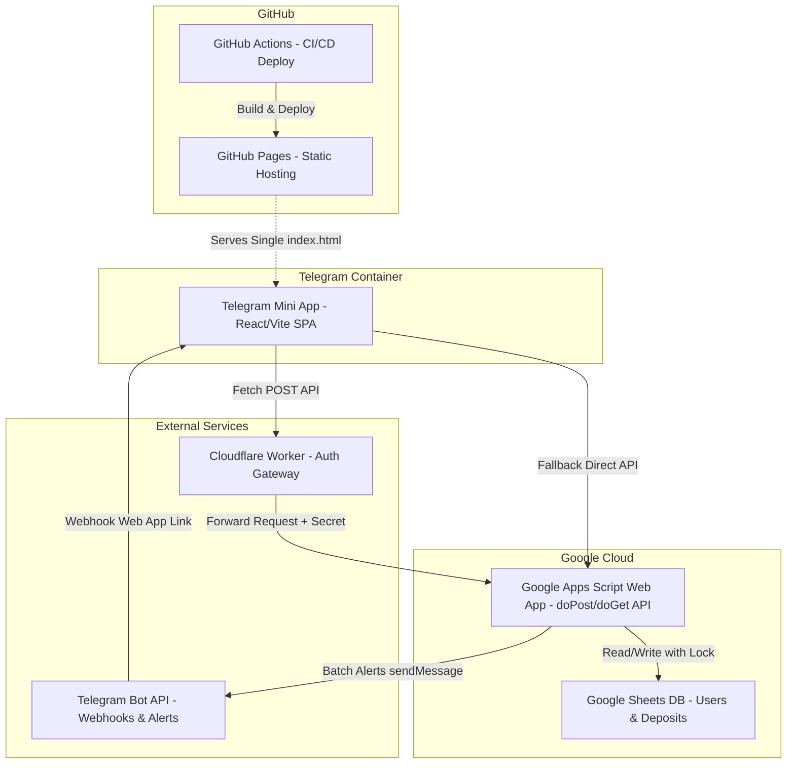

# Milestone v1.0 — Project Summary

**Generated:** 2026-07-14
**Purpose:** Team onboarding and project review

---

## 1. Project Overview

**Save Manager** là ứng dụng cá nhân quản lý các khoản tiết kiệm cá nhân chạy trên nền tảng Google Apps Script (GAS) và Google Sheets (làm cơ sở dữ liệu), với giao diện frontend được tích hợp sâu vào Telegram Mini App (TWA) qua Telegram Bot.

### Core Value Proposition
- **Quản lý chính xác:** Theo dõi chi tiết trạng thái (active, matured, rolled_over) và số ngày gửi thực tế của từng khoản tiết kiệm.
- **Tái tục linh hoạt:** Cho phép rollover các khoản đã đáo hạn với vốn gốc/lãi suất mới, lưu trữ lịch sử liên kết (rollover chain) chặt chẽ.
- **Biểu đồ trực quan:** Dự phóng tổng tài sản tăng trưởng theo thời gian (step-wise) giúp người dùng có cái nhìn tổng quan về tăng trưởng tài chính.

### Target Users
- Cá nhân muốn quản lý các khoản tiết kiệm tại các ngân hàng khác nhau một cách tập trung, bảo mật, miễn phí và có cảnh báo tự động qua tin nhắn Telegram.

---

## 2. Architecture & Technical Decisions

Ứng dụng được thiết kế theo mô hình Client-Server gọn nhẹ, tận dụng hạ tầng serverless miễn phí của Google và GitHub:



### Key Technical Choices & Rationale
- **Single-File Frontend SPA:** Google Apps Script không hỗ trợ load các file JS/CSS rời khi nhúng Web App hoặc chạy trong iframe. Giải pháp là biên dịch toàn bộ React frontend, CSS (Tailwind v4) và Chart.js thành một file `index.html` duy nhất bằng `vite-plugin-singlefile`.
- **Google Sheets as DB:** Dễ dàng kiểm tra chéo, sửa tay dữ liệu khi cần, tích hợp gốc với GAS qua `SpreadsheetApp`. Sử dụng cơ chế khóa `LockService.getScriptLock()` bảo vệ các hành động ghi để tránh race condition khi ghi đồng thời.
- **Date Storage as Plain Text:** Cố định lưu trữ ngày dạng chuỗi thô `DD/MM/YYYY` (ví dụ: `10/07/2026`) để tránh lỗi trôi ngày do khác biệt múi giờ giữa GAS server (thường là UTC) và thiết bị người dùng (GMT+07).
- **HMAC-SHA256 Signature Verification:** Xác thực tính toàn vẹn của gói tin khởi tạo `initData` từ Telegram bằng khóa bí mật (Bot Token) và kiểm tra hạn sử dụng 24h để ngăn replay attacks. Bổ sung cổng Cloudflare Worker để offload xác thực bot token và bảo mật.
- **Canvas-ref Chart.js Integration:** Nhúng Chart.js trực tiếp qua Canvas reference trong React 19 để tối ưu kích thước gói bundle và tránh xung đột peer dependency.

---

## 3. Phases Delivered

Milestone v1.0 được hoàn thành qua 5 Phase phát triển tuần tự:

| Phase | Name | Status | One-Liner |
| :---: | ---- | :----: | --------- |
| **1** | [DB & clasp Project Setup](file:///.planning/phases/01-db-clasp-project-setup/01-01-SUMMARY.md) | ✅ Complete | Thiết lập schema Google Sheets và môi trường đồng bộ clasp với GAS |
| **2** | [Backend DB Operations & Calculations](file:///.planning/phases/02-backend-db-operations-calculations/02-01-SUMMARY.md) | ✅ Complete | Phát triển core logic tính lãi, lưu trữ ngày thô và cơ chế LockService |
| **3** | [Telegram Bot Webhook Integration](file:///.planning/phases/03-telegram-bot-webhook-integration/03-01-SUMMARY.md) | ✅ Complete | Kết nối Telegram Webhook, đăng ký trigger quét đáo hạn hàng ngày & gửi thông báo batch |
| **4** | [Frontend UI (TWA) & Auth](file:///.planning/phases/04-frontend-ui-twa-auth/04-01-SUMMARY.md) | ✅ Complete | Xây dựng giao diện React SPA, inlined bundle, tích hợp Telegram SDK & form nhập liệu |
| **5** | [Charts & Rollover Mechanics](file:///.planning/phases/05-charts-rollover-mechanics/05-01-SUMMARY.md) | ✅ Complete | Tích hợp biểu đồ tăng trưởng Step-wise và cơ chế tái tục cập nhật chuỗi liên kết |

---

## 4. Requirements Coverage

Toàn bộ các yêu cầu chức năng đặt ra cho phiên bản v1 đều đã được hoàn thành đầy đủ:

- ✅ **DB-01:** Thiết lập Google Sheets database tự động với 2 bảng `Users` và `Deposits`.
- ✅ **DB-02:** Cơ chế khóa ghi bằng `LockService` ngăn ngừa race condition hiệu quả.
- ✅ **API-01:** Cung cấp API `doPost` tiếp nhận JSON định tuyến các hành động `get_deposits`, `add_deposit`, `rollover_deposit`.
- ✅ **API-02:** Tự động tính toán tiền lãi dự tính chính xác dựa trên ngày đáo hạn và ngày tạo.
- ✅ **API-03:** Cấu hình timezone `Asia/Ho_Chi_Minh` đồng bộ cho toàn bộ GAS project và Sheet.
- ✅ **BOT-01:** Thiết lập webhook Telegram Bot thành công phản hồi lệnh `/start` mở TWA.
- ✅ **NOTF-01:** Trigger kiểm tra hàng ngày (7h-8h sáng), quét các khoản sắp đáo hạn (≤ 3 ngày) hoặc quá hạn, gom nhóm gửi một tin nhắn batch duy nhất qua Telegram Bot.
- ✅ **UI-01:** Xây dựng React SPA compile ra 1 file `index.html` và deploy tự động lên GitHub Pages qua GitHub Actions.
- ✅ **UI-02:** Giao diện hiển thị danh sách các khoản tiết kiệm cần hành động (overdue hoặc due ≤ 3 ngày) kèm bottom sheet chi tiết.
- ✅ **UI-03:** Tích hợp `@telegram-apps/sdk` đồng bộ theme tự động và hỗ trợ mock mode trên local browser.
- ✅ **STAT-01:** Biểu đồ tăng trưởng tổng tài sản dạng step-wise (chỉ nhận lãi vào ngày đáo hạn) hiển thị động từ hôm nay đến ngày đáo hạn xa nhất.
- ✅ **DEP-01:** Form thêm mới khoản tiết kiệm trực quan hỗ trợ nhập mask ngày `DD/MM/YYYY`, validation inline và preview lãi suất realtime.
- ✅ **DEP-02:** Tính năng Tái tục (Rollover) tự động tính toán đề xuất dữ liệu (+1 năm cho ngày đáo hạn, lấy ngày đáo hạn cũ làm ngày tạo mới), ghi nhận liên kết `parent_id` giữa các thế hệ khoản gửi.

---

## 5. Key Decisions Log

Dưới đây là các quyết định thiết kế quan trọng trong suốt quá trình phát triển hệ thống:

| ID | Quyết định (Decision) | Bối cảnh & Lý do (Rationale) | Phase |
| :---: | --------------------- | ---------------------------- | :---: |
| **D-01** | Standalone Script | Phát triển code TypeScript local, push qua clasp giúp quản lý phiên bản bằng Git độc lập dễ dàng hơn. | Phase 1 |
| **D-02** | Config via Script Properties | Lưu ID Google Sheets trong Script Properties thay vì hardcode để tăng tính linh hoạt và bảo mật. | Phase 1 |
| **D-03** | Date format `DD/MM/YYYY` | Tránh trôi múi giờ trên GAS server bằng cách lưu dạng Plain Text và parse thủ công trên cả client/server. | Phase 2 |
| **D-04** | Lock Timeout 10s | Đảm bảo tính toàn vẹn dữ liệu, chống ghi đè khi nhiều giao dịch đồng thời xảy ra, giải phóng khóa trong khối `finally`. | Phase 2 |
| **D-05** | Webhook Token Auth | Xác thực nguồn gọi từ Telegram bằng query parameter `?token=...` trên URL Webhook do GAS không đọc được HTTP headers. | Phase 3 |
| **D-06** | Message Grouping | Gom nhóm các cảnh báo đáo hạn của một user và gửi một tin nhắn tổng hợp duy nhất thay vì gửi tin lẻ nhằm tránh rate limit. | Phase 3 |
| **D-07** | Local Mock Development | Hỗ trợ phát triển và debug nhanh trên trình duyệt Chrome/Firefox ngoài container Telegram bằng cơ chế fallback `mock_hash`. | Phase 4 |
| **D-08** | Inlined SPA Build | Dùng `vite-plugin-singlefile` gom CSS/JS/HTML thành 1 file để tương thích hoàn toàn với cơ chế phân phối của GAS Web App. | Phase 4 |
| **D-09** | Action-Required Focus | Giao diện danh sách mặc định chỉ hiện các khoản cần xử lý (quá hạn hoặc sắp đáo hạn ≤ 3 ngày) để tối ưu trải nghiệm tập trung. | Phase 4 |
| **D-10** | Prefill Rollover Logic | Tái tục tự động lấy ngày đáo hạn cũ làm ngày bắt đầu mới, cộng thêm 1 năm cho ngày đáo hạn mới (leap-year guard). | Phase 5 |
| **D-11** | Step-wise Asset Growth | Tổng tài sản trên đồ thị chỉ tăng vọt tại đúng ngày đáo hạn của khoản gửi, phản ánh đúng thực tế nhận lãi. | Phase 5 |

---

## 6. Tech Debt & Deferred Items

Mặc dù ứng dụng đã hoàn thiện các tính năng cốt lõi v1, một số điểm cần lưu ý và cải tiến sau này:

### Tech Debt & Gaps
- **Kiểm thử thủ công UI (UAT Gaps):** Một số tính năng giao diện (BottomSheet trượt, tương tác hover Chart.js, nút bấm trực quan trên Telegram) hiện tại chỉ được kiểm thử tự động một phần và giả lập mock. Cần người dùng thực hiện UAT thủ công cuối cùng theo quy trình trong [05-UAT.md](file:///.planning/phases/05-charts-rollover-mechanics/05-UAT.md).
- **Sao lưu cơ sở dữ liệu:** Chưa có cơ chế backup cơ sở dữ liệu tự động ra ngoài Google Sheets. Dựa hoàn toàn vào tính năng Version History tích hợp sẵn của Google Sheets.

### Deferred Items (v2 Backlog)
- **AUTH-02 (Secure signature validation):** Nâng cấp xác thực đầy đủ signature của Telegram Web App cho môi trường đa người dùng (hiện tại đã triển khai cơ bản dạng HMAC-SHA256).
- **STAT-02 (Savings Distribution Analyser):** Phân tích tỷ trọng phân bổ các khoản tiết kiệm theo kỳ hạn hoặc theo ngân hàng (đã có biểu đồ cột thu gọn hiển thị tổng quan ngân hàng tại Phase 5).
- **Trang xem lịch sử chi tiết:** Hiện tại hệ thống ẩn các khoản có trạng thái `rolled_over`. Cần một giao diện riêng để xem phả hệ (lineage tree) các khoản tái tục từ quá khứ.

---

## 7. Getting Started

### Thư mục dự án
- `/backend/` — Mã nguồn Google Apps Script (Javascript chạy trên V8 engine).
- `/frontend/` — Mã nguồn Telegram Mini App (React + TS + Tailwind v4 + Chart.js).

### Lệnh chạy kiểm thử backend (Node.js)
```bash
# Chạy bộ test suite giả lập trực tiếp trên local console
node -e "const fs = require('fs'); global.Logger = { log: console.log }; eval(fs.readFileSync('backend/Code.js', 'utf8')); eval(fs.readFileSync('backend/Tests.js', 'utf8')); runTests();"
```

### Thiết lập môi trường phát triển frontend
```bash
cd frontend
npm install
npm run dev # Khởi động dev server local với mock Telegram environment
```

### Quy trình Deploy
1. **Frontend:** Commit và push code lên nhánh `main`. GitHub Actions tự động build và deploy lên GitHub Pages.
2. **Backend:**
   ```bash
   cd backend
   clasp push   # Push mã nguồn lên Google Apps Script
   clasp deploy # Tạo version deploy mới cho Web App (nếu cấu hình routing thay đổi)
   ```
3. **Cấu hình Triggers:** Chạy hàm `setupDailyTrigger()` một lần trên GAS Editor để lập lịch quét đáo hạn tự động 7h-8h sáng hàng ngày.
