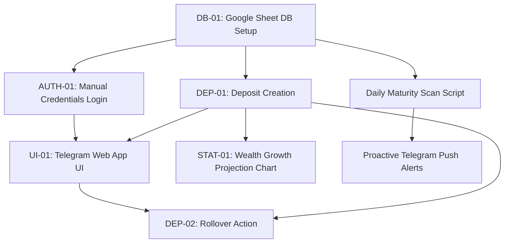

# Feature Research

**Domain:** Personal Finance / Savings Management (Google Apps Script + Google Sheets + Telegram Web App)
**Researched:** 2026-07-10
**Confidence:** HIGH

## Feature Landscape

### Table Stakes (Users Expect These)

Features users assume exist. Missing these = product feels incomplete.

| Feature | Why Expected | Complexity | Notes |
|---------|--------------|------------|-------|
| **Manual Credentials Login** (AUTH-01) | Authenticates user in the Web App to secure access to deposits. | LOW | Uses `username_bankcode` to read matching sheet row. Session stored in `localStorage` to avoid re-login. |
| **Google Sheets Database Integration** (DB-01) | Stores user records and deposit lists in spreadsheet rows. | LOW | GAS uses `SpreadsheetApp` to query/write. Sheets serve as UI fallback. |
| **New Deposit Creation** (DEP-01) | Adds a deposit record (Amount, Rate, Created Date, Maturity Date). | MEDIUM | Web App UI form. Automatic backend calculation of expected interest before saving to sheet. |
| **Roll-over (Reinvestment) Action** (DEP-02) | Resolves matured deposits. User modifies principal, system creates new active deposit & logs old in history. | HIGH | Requires concurrency locking (`LockService`), archiving logic, and multiple row updates. |
| **Deposit List & Status Views** | Displays active, matured, and archived deposits. | MEDIUM | Filters sheet data by status column. Responsive list layout with state indicators. |
| **Basic Balance Overview** | Shows total deposited amount and projected total wealth (principal + expected interest). | LOW | Computed dynamically by summing spreadsheet column values or frontend reduction. |

### Differentiators (Competitive Advantage)

Features that set the product apart. Not required, but valuable.

| Feature | Value Proposition | Complexity | Notes |
|---------|-------------------|------------|-------|
| **Future Wealth Projection Chart** (STAT-01) | Visualizes net worth growth over time using a timeseries chart. | MEDIUM | Chart.js reads active deposits maturity dates to plot aggregate value growth (principal + interest steps). |
| **Telegram App Viewport Integration** (UI-01) | Embeds as native Telegram Web App. Seamless, app-like styling using Telegram CSS theme variables. | MEDIUM | Integrates `@telegram-apps/sdk`. Responsive viewport scaling, native Telegram Back/Main Buttons usage. |
| **Maturity Alerts (Proactive Push)** | Sends Telegram message to user when deposit is within X days of maturity. | MEDIUM | GAS Time-driven trigger (cron) sweeps sheets daily; sends messages to user chat IDs via Telegram Bot API webhook. |
| **Direct Sheet Syncing & Validation** | Safely permits manual edits inside Google Sheet without breaking the Web App. | HIGH | Sturdy row-level parsing with default values and validation rules to handle messy or missing manual data. |

### Anti-Features (Commonly Requested, Often Problematic)

Features that seem good but create problems.

| Feature | Why Requested | Why Problematic | Alternative |
|---------|---------------|-----------------|-------------|
| **Real-time SMS/Email Alerts** | Quick alerts for any updates. | Hits GAS daily quota limits quickly, adds latency. | Daily cron digest sent directly to Telegram Bot (virtually unlimited and free). |
| **Telegram Chat ID Auto-Auth** | Frictionless entry on opening. | Ties access strictly to Telegram Account. Hard to switch devices/accounts, complex backend sync. | Manual `username_bankcode` login. Simple, portable, secure enough, zero server-side state. |
| **Multi-currency Support & Live Exchange Rates** | Track foreign currency deposits. | External API fetch on load delays rendering. GAS execution timeouts, sheets formatting complexity. | Single default currency. Let user manage conversion/rate differences in separate sheets manually. |
| **Automated Bank Syncing (Scraping/API)** | Imports deposits automatically from banks. | High security risk. Violates bank terms. High maintenance API adapters. | Clean manual input form on Telegram Web App. Takes 5 seconds, absolute privacy. |

---

## Feature Dependencies

### Dependency Notes

- **Manual Credentials Login (AUTH-01) requires Google Sheet DB Setup (DB-01):** Validates input `username_bankcode` against rows in the `Users` sheet.
- **Telegram Web App UI (UI-01) requires Manual Credentials Login (AUTH-01):** The user's active session must be verified to load corresponding deposits.
- **Rollover Action (DEP-02) requires Deposit Creation (DEP-01) & DB Setup (DB-01):** Rollover logic reads an existing deposit, marks it rolled over, and creates a brand-new active deposit row.
- **Wealth Growth Projection Chart (STAT-01) enhances Telegram Web App UI (UI-01):** Provides users with an interactive, actionable visualization of their future wealth timeline.
- **Proactive Telegram Push Alerts requires Daily Maturity Scan Script:** A time-driven Google Apps Script cron sweeps the database daily to identify nearing/matured deposits and triggers Bot API calls.

---

## MVP Definition

### Launch With (v1)

Minimum viable product — what's needed to validate the concept.

- [ ] **DB-01 (Google Sheet DB)** — Core repository for users and deposits data. Essential for any data persistence.
- [ ] **AUTH-01 (Manual Login)** — Authenticates user session inside Telegram Web App using a custom string.
- [ ] **DEP-01 (Deposit Entry)** — Input form to create savings entries with automatic interest calculation.
- [ ] **DEP-02 (Rollover Action)** — Basic rollover interface to handle matured deposits and archive old records.
- [ ] **UI-01 (Telegram Web App Integration)** — Renders responsive HTML/CSS/JS frontend inside the Telegram wrapper.
- [ ] **STAT-01 (Wealth Growth Chart)** — Basic timeseries chart showing projected net worth over the next 12 months.

### Add After Validation (v1.x)

Features to add once core is working.

- [ ] **Maturity Push Alerts** — Triggered once the core flow is stable to improve user retention and rollover action rates.
- [ ] **Direct Sheet Sync Validation** — Built once users start manually editing the Google Sheets, to prevent parsing crashes.
- [ ] **Multi-account Switcher** — Allow user to manage multiple bank accounts (`username_bankcode` strings) and switch between them in the UI.

### Future Consideration (v2+)

Features to defer until product-market fit is established.

- [ ] **Partial Withdrawal Calculator** — Deferred due to high logic complexity in calculating compound/prorated interest rates.
- [ ] **Bank Statement Parser (OCR/Email)** — Let users upload screenshot/email receipts to auto-populate deposits.
- [ ] **Multi-currency Tracking** — Add support for multiple concurrent currencies and manual exchange rates.

---

## Feature Prioritization Matrix

| Feature | User Value | Implementation Cost | Priority |
|---------|------------|---------------------|----------|
| **Google Sheet DB Setup (DB-01)** | HIGH | LOW | P1 |
| **Manual Login (AUTH-01)** | HIGH | LOW | P1 |
| **Deposit Creation Form (DEP-01)** | HIGH | MEDIUM | P1 |
| **Rollover Action (DEP-02)** | HIGH | HIGH | P1 |
| **Telegram Web App UI (UI-01)** | HIGH | MEDIUM | P1 |
| **Growth Projection Chart (STAT-01)** | MEDIUM | MEDIUM | P1 |
| **Proactive Maturity Push Alerts** | HIGH | MEDIUM | P2 |
| **Direct Sheet Sync Sanitizer** | MEDIUM | HIGH | P2 |
| **Multi-account Switcher** | MEDIUM | LOW | P2 |
| **Partial Withdrawals** | LOW | HIGH | P3 |
| **Multi-currency Support** | LOW | MEDIUM | P3 |
| **OCR Bank Statement Parsing** | MEDIUM | HIGH | P3 |

**Priority key:**
- P1: Must have for launch
- P2: Should have, add when possible
- P3: Nice to have, future consideration

---

## Competitor Feature Analysis

| Feature | Fin-bot-miniapp | MoneyNeBot | Our Approach |
|---------|-----------------|------------|--------------|
| **UI Type** | Telegram Web App (Mini App) | Telegram Web App (Mini App) | Telegram Web App (Mini App) |
| **Storage Backend** | Go + SQLite (binary) | GAS + Google Sheets | GAS + Google Sheets |
| **Auth Flow** | Telegram `initData` signature | Telegram `initData` signature | Manual `username_bankcode` entry |
| **Savings Tracking** | Income/Expense ledger focus | Auto bank transaction sync (via email) | Dedicated deposit maturity, rollover, interest tracker |
| **Wealth Projection** | Simple monthly stats | No visual charts | **Chart.js** dynamic future wealth growth timeseries |
| **Self-Auditing** | Difficult (requires database queries) | Easy (direct Google Sheet view) | **Easy (direct Google Sheet view)** |

---

## Sources

- [Telegram Mini Apps Documentation](https://core.telegram.org/bots/webapps) — Auth validation, theme support, viewport control.
- [funfinance/fin-bot-miniapp](https://github.com/funfinance/fin-bot-miniapp) — Reference implementation of database models and Web App UI structure.
- [izlabs/MoneyNeBot](https://github.com/izlabs/MoneyNeBot) — Integration patterns between Google Sheets, GAS, and Telegram Mini Apps.
- [Google Apps Script Quotas & Limits](https://developers.google.com/apps-script/guides/services/quotas) — Guidance on execution timeout (6 minutes) and trigger limits.

---
*Feature research for: personal-finance/save-manager*
*Researched: 2026-07-10*
